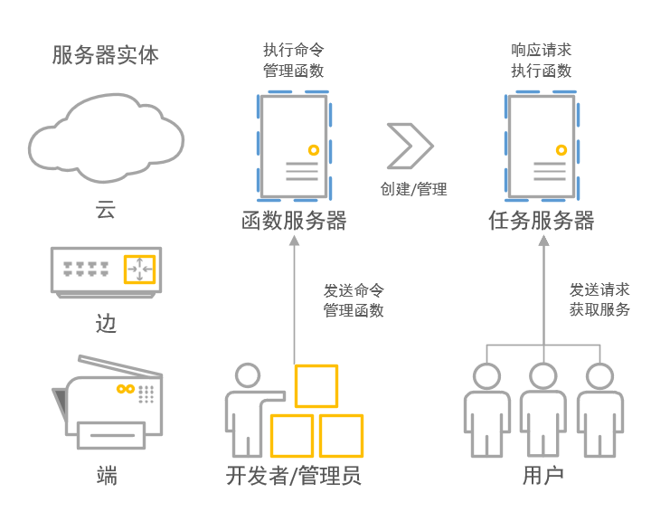

# 4-烫烫烫

## 项目介绍
TOPIC_ID:4, TEAM_ID:1111801008, TEAM_NAME:烫烫烫.
#### 概述
本项目旨在开发一个高性能、低资源占用的Linux用户态函数计算任务框架。
该框架的设计以赛题要求为基础，并进行了一定拓展。
框架的资源占用及性能可通过参数配置或由框架自动调整，进而可用于云边端各类设备，使其具备FaaS的能力。

当前已完成赛题要求的核心工作，当前可进行多线程任务监听和执行，可承受多线程并发、百万请求量。
/core/worker/worker_tools.h中包含了新增、暂停、恢复、删除、请求函数的功能接口。
执行auto-build.sh自动编译后，build目录会生成tools库。
#### 项目背景
虚拟化、云计算等技术的出现将开发者从繁重的服务器运维工作中初步解放出来。
近来兴起的Serverless则将应用的部署、资源伸缩等工作一并交由云平台管理。
这使得开发者可以聚焦应用功能开发，企业得以降低服务成本。
然而，当前许多Serverless框架使用单独的容器作为每次函数执行的环境，存在过度隔离导致的资源使用效率低、启动延迟高等问题。
#### 开发思路
项目成员经过学习调研，分析了影响资源占用和启动延迟的关键因素，结合体系结构、操作系统基本原理，对本框架进行了设计和论证。
本设计采用分级隔离模型，对于不同租户、不同应用以及同一应用内不同函数采取不同级别的隔离，减少过度隔离导致的开销。
框架采用轻量化任务抽象，减少复杂系统抽象（如容器、进程）所导致的资源占用和延迟。
经过实验分析，执行同一函数任务条件下，本框架耗时相较Process forking方案可低51倍。若加上通信等开销则预计可快两个数量级。测试代码及数据解释见目录/examples/speed_test
依据ATC'18 《SAND...》的实验数据推算，该框架相较容器级FaaS框架的Execution Engine可快5个数量级。
当然，隔离性也差好几个数量级。后期会对隔离性等问题做优化。
### 软件架构
#### 架构说明
本项目在开发之初就希望基于大赛题目，结合已有容器方案做一个可拓展、高并发FaaS平台。因此做了很多赛题要求之外的规划，整体的完整架构描述见/docs/Architecture_overview.md


大赛题目要求对应的是本项目的Core-Worker部分，也是前期主要完成的部分。代码见/core/worker

#### Worker架构概概览
当Worker被独立使用时，其本身作为一个函数服务器，响应开发者、管理员的命令。开发者上传函数任务后，函数服务器会fork出任务服务器，并返回服务地址。任务服务器用于响应用户的请求，并接受函数服务器的管理。承载两者的实体服务器可以是云、边、端各类Linux设备。整体关系如下图所示。



#### 运行时架构
任务服务器的核心是用于调度和执行任务的运行时。在开发者将函数的二进制文件及其配置提交后，框架根据配置文件解析包含函数的二进制文件。在开发者提交的函数计算任务准备就绪后，框架开始监听与函数相关联的路由，等待用户请求。
负责处理用户请求，执行与请求对应函数的系统暂且称为运行时系统（Runtime，对应FaaS框架中的概念又称为Execution Engine）。运行时系统主要由三类实体组成，分别是Brick、Cart和Labor，对应关系如图。


- Supervisor：综合管理线程，包括管理Cart与Labor的绑定关系，Brick执行时的审计、挂起和恢复等。
- Brick：函数计算任务的载体，框架调度、并发的基本单位。框架在接收到用户发送的请求即新建一个与之对应的brick，其中包含需要执行的函数指针、参数指针、运行状态、堆栈信息等。
- Cart：承载Brick队列及其运行所需资源的实体。其中包含多个Brick实体的任务队列、共享堆栈缓冲区和用于任务调度的各种参数。
- Labor：用于执行函数代码的实体。其本质是操作系统的线程，由操作系统负责调度。一个Labor对应一个Cart，并执行Cart中的Bricks。实体数量上L:C=M:N，一般N为CPU核心数，且M>N。框架将依据策略管理Labor与Cart的对应关系。例如Labor被操作系统阻塞时，Cart会对应其他Labor。

#### 搬砖的故事
通过这三个概念的命名，可以想象如下画面：
用户打电话（发请求）给砖厂要买砖(brick）。厂长（框架、调度器、Supervisor）于是指挥工人（labor）推一辆推车（carrt），根据订单（请求信息）从砖窑里搬砖给用户。有的砖刚烧制完成，很烫手，工人搬一块就要歇一下（阻塞）；也有时妈妈打电话喊他回家吃饭（被OS调度让出）。但是推车不怕烫，也没有妈，于是精明的厂长会安排多个工人轮流使用推车搬砖。
#### 正经点
当用户请求了函数服务，框架在接到消息后新建一个Brick（或复用一个已经释放的Brick），将与请求相关信息如函数指针、参数等信息存入Brick。随后将该Brick指针插入到某Cart队列中，等待执行。
Cart任务队列中的任务不断被调度器弹出至与Cart对应的Labor，执行函数代码。
由于开发者提交的函数中可能包含某些系统调用导致Labor被操作系统长时间阻塞，或函数执行遇到问题导致超时。因此调度器会依据策略将Cart移交给其他空闲Labor，由新对应的Labor继续执行队列中的Brick。这也是一般情况下Cart数量与机器核心数相同且大于Labor数量的原因。
当被阻塞线程满足唤醒条件得以继续执行时，继续执行刚才的Brick。执行完毕后通过检查标志位发现自己已经没有对应的Cart，则休眠等待被调度器唤醒。
Supervisor作为一个单独的线程负责综合管理工。如通过观察负载状况修改Cart与Labor的绑定关系、通过信号控制Labor的任务挂起、恢复等工作。
这样的设计主要是为了满足高并发场景下高性能、低资源占用的需求，同时保障框架的拓展性和多语言兼容性。
#### 主要优势
1. 低资源占用。由于函数实体和运行时复用、堆栈共享，因此每个新增的并发只会增加KB级的内存消耗。
2. 低启动延迟。相较传统FaaS框架减少了任务无关代码耗时，且框架以极低占用保活，避免了容器冷启动导致的高延迟。
3. 高执行速度。将调度单位与资源单位解耦，充分利用了多核、缓存等硬件特性提高了代码的执行速度和效率。无锁多队列设计避免了数据竞争可能导致的延迟和死锁。
4. 多语言支持。虽然该框架以支持二进制任务实体为初级目标，但也考虑到了后续对多语言支持。在BCL架构中，B、C是语言无关的，只记录了必要的参数，而Labor则可以适配多语言，可以有Binary-Labor，也可以有Python-Labor。当然，也可以通过LLVM-WebAssembly方案做多语言支持，欢迎讨论。

### 安装及编译教程

1. 确认cmake版本3.13及以上。
```shell script
chomod +x ./auto-build.sh
```
2. 脚本自动下载依赖并编译，完成后到build目录下查看，其中lutf为主程序，其他为各种测试程序。

### 使用说明

通过demo/hello_world目录下的演示程序可以了解整个使用过程。以下内容供深入了解。

#### 目录说明
1. /bin 启动服务等功能的脚本，还在完善中。
2. /core 核心框架的代码，若只是使用框架，关注/core/worker/worker_tools.*即可。
3. /demo 演示程序。
4. /docs 部分文档，与具体代码如worker、speed_test等相关文档见其目录。
5. /examples 开发过程中为做验证测试的遗留文件，一般可忽略。
6. /image 图片存放。

#### 概念说明
与lutf的交互有五种情况：1.添加函数 2.暂停函数 3.恢复函数 4.删除函数 5.接收请求，执行函数

lutf在开启时监听url_func,函数开发者、管理员可以通过这个端口添加、暂停、恢复和删除函数任务。

当开发者或管理员通过url_func提交了一个函数，那么lutf会为该函数生成一个url_work,用户请求该路由则会执行函数并返回结果。
#### 测试步骤

1. 完成安装和编译后，在build目录下运行./lutf，即可以默认模式开启主服务
2. 若希望修改lutf监听的地址，则运行 ./lutf <url_func>
3. 运行./worker_test_ppdi 即可以默认方式打开客户端测试程序
4. 若想修改地址，则可以运行./worker_test_ppdi <url_func> <url_work> 其中url_func与lutf的监听地址相同，url_work自定义。
5. worker_test_ppdi可以模拟计算密集型任务，worker_test_sleep可模拟IO密集型任务。
6. worker_test_xxx将完成两个步骤1.完成添加函数的请求，获得函数对应的work_url。2.根据work_url发起多次执行函数的请求。
7. 可通过修改COUNT宏定义配置test程序发起执行函数请求的次数,当前默认10000次。
8. 根据worker_tools.h可以看到已实现的操作接口，用于开发更多程序。

#### 测试示例

见demo目录

### 参与贡献

1.  Fork 本仓库
2.  新建 Feat_xxx 分支
3.  提交代码
4.  新建 Pull Request
