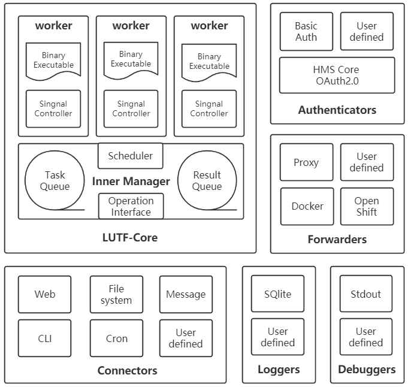
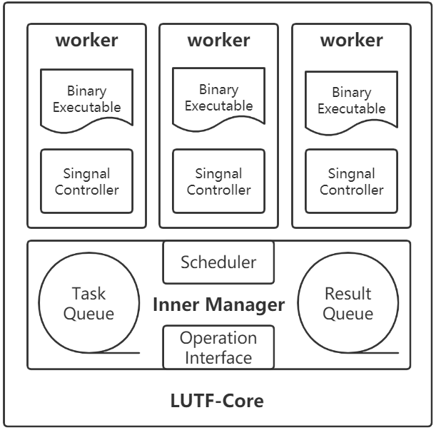
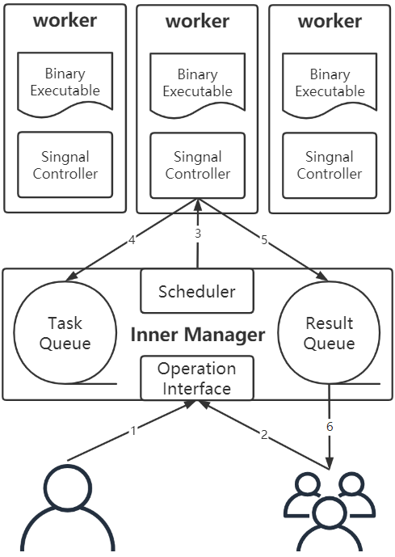

# LUTF架构介绍

## 架构概览
本项目希望将LUTF实现为一个可应用在云边端的性能范儿函数服务框架。
一个完整的函数服务器软件架构如下所示。

### 整体概述
以上架构图中，可分为内层核心和外围部件两部分。
内层核心是本项目的重点，实现多个二进制任务实体在一个进程内的并发调度。目的是解决已有框架的资源利用效率低、延迟高等问题。
外围部件是基于容器实现的函数服务框架，用于在更大规模的计算资源中拓展服务。各大开源平台中已有相关实现，一些论文也做了优化工作，可以借鉴使用。
### LUTF-Core
核心的功能主要是：在事件的驱动下，调度对应的任务运行，并返回结果。
区别于已有FaaS框架的主要有两方面：
- 任务实体格式：用户提交的任务实体为二进制格式，而不是函数源码或打包好的容器镜像等。
- 任务运行环境：经典FaaS框架倾向于为每个函数或请求开辟专用容器，本框架则是在一个进程的资源范围内调度多个任务。
因此该框架将拥有极致的性能，但安全漏洞也增多了，任务间共享内存、复用I/O都会有新问题。
虽然赛题没有要求，但若各位参与开发的同志有解决新问题的想法欢迎提issue讨论，这非常有价值。
### External-components
外围部件中Connectors、Forwarders是最先需要实现的。
其中Connectors其实就是触发器，可以先实现常用的，可以支撑演示即可。
Forwarders则是支撑框架在集群环境中提供弹性计算的基础，故应优先实现。
其他部分后续安排。
## 核心架构
为使得大家明确大概方向，不至于一头雾水，下面介绍当前设想的核心实现细节。
由于只是个人的、临时的想法，所以细节还需要大家讨论之后再实现。

### 概念实体
核心整体是一个进程。可以运行在一个容器、虚拟机或者就是边端的单板计算机的系统上。
Inner Manager和workers是线程，在启动时被初始化。分别负责调度和执行具体的函数任务。
Binary Executable是函数任务实体，本质上是动态链接库。
当函数任务被调用时，运行中的函数任务在概念上类似于协程。相较线程采用更加轻量级的上下文，且可以由用户态程序对其进行控制。
### 具体设计
- manager线程负责整个核心的初始化、任务请求监听、资源回收处理等工作。在请求到来时解析任务，将必要信息发至消息队列，并通过信号调度worker线程工作。
- worker在初始化完成后等待manager发来的信号，并依据信号指示工作。当需要存取数据时从消息队列中取。
## 核心运作流程

简要介绍一个任务的处理过程:

1. 管理者（应用开发者）提交任务实体和配置文档到平台，并最终分配到一个核心，解析和存储函数任务。
2. 应用的使用者请求该函数服务，请求信息被承载该函数的容器接收、解析。
3. manager的调度器将消息发布至内部消息队列中，并通过信号通知指定worker线程工作。
4. worker接到信号后从任务消息队列中获取所需信息并执行该任务。类似的，当信号为中断、上下文切换等语义时，执行相应动作。
5. 任务执行完毕后返回任务结果到结果消息队列。
6. 将任务执行结果返回至用户。